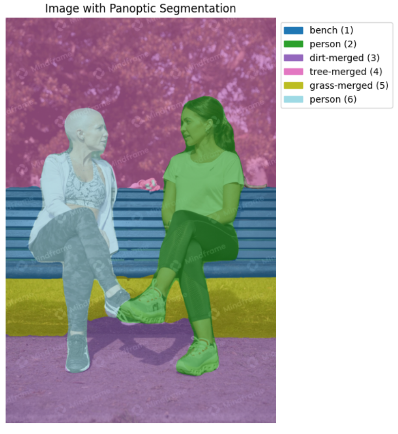
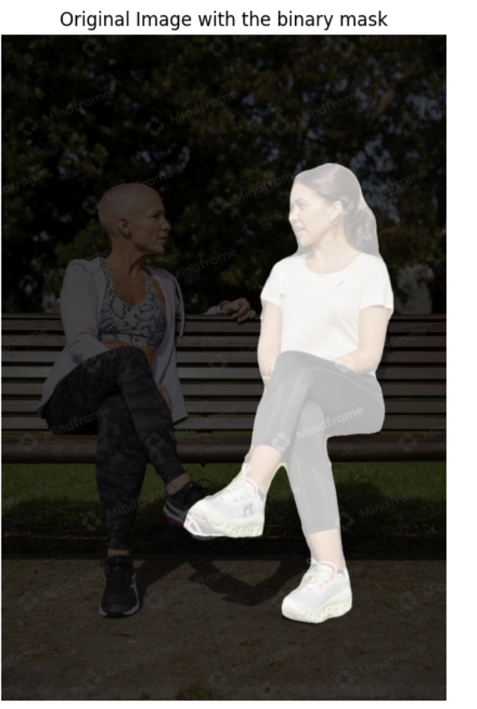
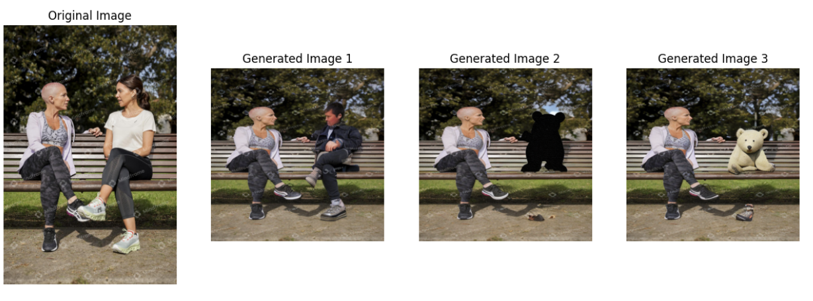
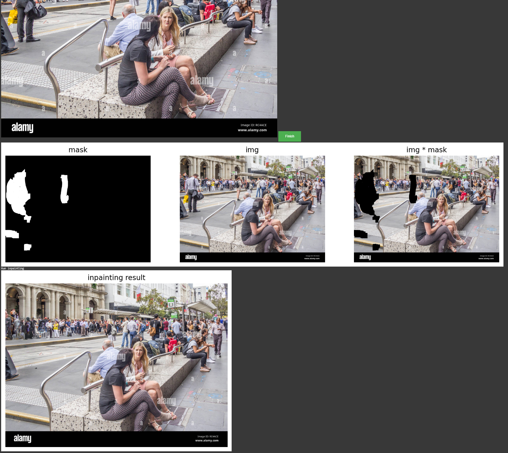

# 🧽 Interactive Object Removal with AI Inpainting

Remove unwanted objects from images using computer vision and generative AI. This project provides two interactive workflows:

* **Semantic Segmentation Mode**: Select objects to remove based on class labels (e.g., person, car) using Mask2Former, then inpaint using Stable Diffusion.
* **Freehand Masking Mode**: Manually draw over objects using an HTML canvas and inpaint using the LaMa model.

Runs entirely in Google Colab — no local setup required.

---

## ✨ Features

* 🔍 **Semantic segmentation** with [Mask2Former](https://huggingface.co/facebook/mask2former-swin-large-coco-panoptic) (COCO labels)
* 🧠 **Prompt-based inpainting** with [Stable Diffusion 2 Inpainting](https://huggingface.co/stabilityai/stable-diffusion-2-inpainting)
* ✏️ **Freehand masking** via interactive HTML5 canvas in Colab
* 🧽 **Fast inpainting** using [LaMa](https://github.com/saic-mdal/lama) (via [simple-lama-inpainting](https://github.com/enesmsahin/simple-lama-inpainting))
* 🖼️ Visual output with overlay masks and multiple regenerated results
* ☁️ Zero setup — designed for Google Colab

---

## 📁 Notebooks

| Notebook | Description | Open in Colab |
|----------|-------------|----------------|
| [`object_removal_via_segmentation_and_prompts.ipynb`](object_removal_via_segmentation_and_prompts.ipynb) | Select objects using panoptic segmentation and regenerate the masked area using Stable Diffusion. |  |
| [`freehand-object-removal-with-lama.ipynb`](freehand-object-removal-with-lama.ipynb) | Manually draw over objects to remove and inpaint using LaMa. |  |

---

### 🧠 Semantic Segmentation + Prompt-Based Inpainting (Stable Diffusion)

In this workflow, users remove objects by selecting them from panoptic segmentation maps generated by Mask2Former. The masked regions are then regenerated using a user-provided natural language prompt via Stable Diffusion.

1. Upload or link an image
2. Segment it using **Mask2Former**
3. Pick the object by segment ID
4. Enter a natural language prompt to guide the inpainting
5. Generate multiple outputs with Stable Diffusion

#### 🖼️ Example Workflow

**Segmentation with Labels:**

**Binary Mask on Selected Object:**

**Prompt-Based Inpainting Results (3 Samples):**

> 🧠 Example Prompt Used: `"replace it with a bear sitting on a bench"` — change the prompt to control what gets generated!
> 💡 Tip: You can generate different results by changing the text prompt or random seed.

---

### ✏️ Freehand Example (LaMa)

This notebook allows users to manually draw masks over unwanted regions using an interactive HTML5 canvas. After completing the mask, clicking "Finish" triggers inpainting via the fast and lightweight LaMa model.

> 🎨 Simply **click and drag** to draw the mask over the object you want to erase. Then click **Finish** to generate the binary mask and continue.

#### 🖼️ Example Output

* **Top Left:** Binary mask (white = area to remove)
* **Top Center:** Original image
* **Top Right:** Image with mask applied
* **Bottom:** Final inpainted result with LaMa

---

## 🧰 Tech Stack

* **Segmentation:** Mask2Former (COCO panoptic labels)
* **Generative Inpainting:** Stable Diffusion v2
* **Freehand Inpainting:** LaMa (via simple-lama-inpainting)
* **Frameworks & Libraries:** PyTorch, Hugging Face Diffusers & Transformers, OpenCV, PIL, Matplotlib, Google Colab

---

## 🖼️ Image Attribution

The images used in the examples are licensed stock photos included for educational and non-commercial demonstration:

* 🧍‍♀️ *Two People Talking on a Park Bench*
  [Mindframe](https://mindframeimages.org.au/product/two-people-talking-sitting-on-a-park-bench-4/)

* 🏙️ *People on Bourke Street, Melbourne*
  [Alamy](https://www.alamy.com/melbourne-australia-21st-february-2018-people-on-bourke-street-the-street-is-in-the-heart-of-the-main-shopping-area-image231206654.html)

> For public or commercial use, please use your own images or ensure you have proper rights.

---

## 🙏 Acknowledgments

This project is built on top of the following open-source models and repositories:

* [Stable Diffusion 2 Inpainting](https://huggingface.co/stabilityai/stable-diffusion-2-inpainting) by Stability AI
* [Mask2Former Swin Large (COCO)](https://huggingface.co/facebook/mask2former-swin-large-coco-panoptic) by Meta AI
* [Simple LaMa Inpainting](https://github.com/enesmsahin/simple-lama-inpainting), a wrapper for [LaMa](https://github.com/saic-mdal/lama) from Samsung AI

Thanks to the maintainers and researchers behind these tools.

---

## 📄 License

This project is for research and educational purposes. Please check the licenses of each model for commercial use.
